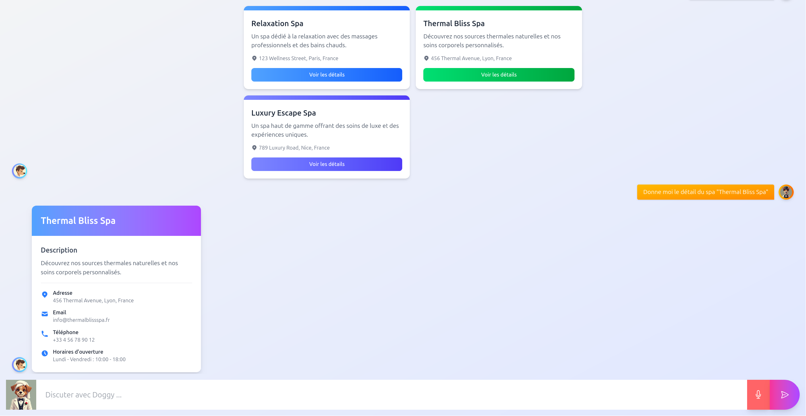

# Frontend - AI ChatBot

Frontend implementation of the AI ChatBot that won the **["24 Heures du Code"](https://les24hducode.fr/)** hackathon.

## 🏆 Objective

The primary goal of the hackathon was to develop a chatbot to automate the reception process at **Hotel California**. Instead of clients having to ask hotel managers for information and make requests manually, they could interact with an AI-powered chatbot that handles basic management tasks seamlessly.

The hackathon organizers provided a pre-developed **REST API** for the Hotel California system. The chatbot's objective was to interpret user requests in natural language and translate them into appropriate API calls.

## 🖥️ Application UI

<div style="display: flex; gap: 20px; justify-content: center; flex-wrap: wrap; margin-bottom: 40px;">
  
  
  
  
</div>


Chatbot usage scenarios can be found in the [assets](assets) directory.  
A video demonstration of the chatbot is available [here](https://youtu.be/9wGZzOV42CM).


## 🚀 Run Application

1. **Clone the repository:**
   ```bash
   git clone https://github.com/24h-du-code-2025/frontend.git <directory>
   ```

2. **Navigate to the repository directory:**
   ```bash
   cd <directory>
   ```

3. **Install dependencies:**
    ```bash
   npm install
    ```

4. **Start the development server:**
    ```bash
   npm run dev
    ```
